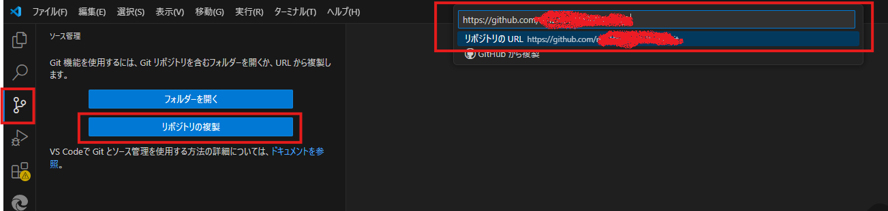
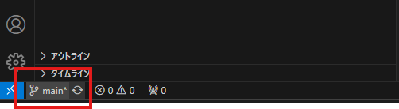
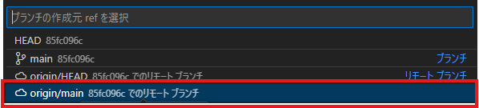

## Java 開発環境の構築

### JDK の DL 及びインストール

1. 以下の URL 等から`JDK 17`を DL
   [(https://www.oracle.com/jp/java/technologies/downloads/](https://www.oracle.com/jp/java/technologies/downloads/)
   インストーラを使用すると PATH やレジストリに設定が追加されるので、不要な方は `x64 Compressed Archive`を使用する
2. DL したファイルをインストールまたはディレクトリに配置

### 拡張機能の導入

- Extension Pack for Java
- (任意) Japanese Language Pack for Visual Studio Code
- (任意) Git Graph または Git History

### JavaHome の設定

1. `Ctrl + ,`で設定を開き、検索欄に `java home`と入力
2. settings.json で編集のリンクを開き、JDK のディレクトリを指定
   ex) `"java.jdt.ls.java.home": "D:\\Users\\xxx\\Projects\\JDK\\jdk-17",`

## リポジトリの開き方

1. ソース管理(`Ctrl + Shift + G`)を開く
2. リポジトリの複製を押下
3. 入力欄にリポジトリの URL を入力して `Enter`

## ブランチの作成

1. 画面左下の｢ブランチまたはタグのチェックアウト｣を選択

   

2. ｢新しいブランチを以下から作成｣を選択

   

3. ブランチの作成元として `origin/main`を選択

   

4. 作成するブランチ名(自分のブランチだとわかる名称)を指定して `Enter`

   
