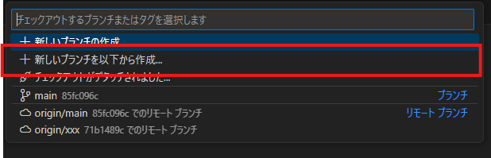

## Java開発環境の構築

### 拡張機能の導入

- Extension Pack for Java
- (任意) Japanese Language Pack for Visual Studio Code
- (任意) Git Graph または Git History

## リポジトリの開き方

1. ソース管理(`Ctrl + Shift + G`)を開く
2. リポジトリの複製を押下
3. 入力欄にリポジトリのURLを入力して `Enter`

## ブランチの作成

1. 画面左下の｢ブランチまたはタグのチェックアウト｣を選択

   
2. ｢新しいブランチを以下から作成｣を選択

   
3. ブランチの作成元として `origin/main`を選択

   
4. 作成するブランチ名(自分のブランチだとわかる名称)を指定して `Enter`

   
